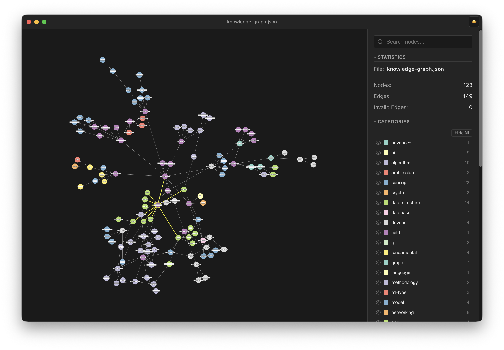
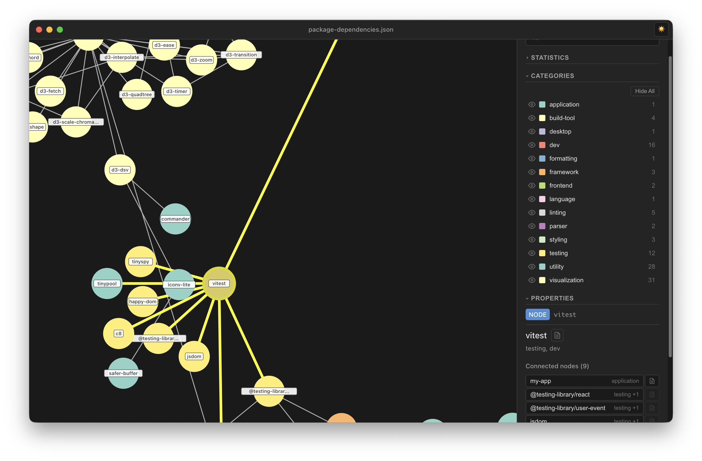
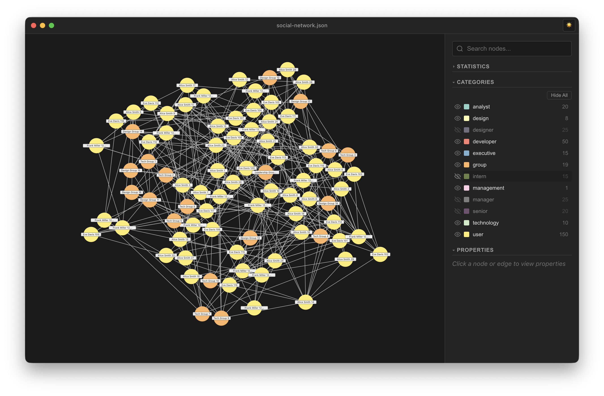
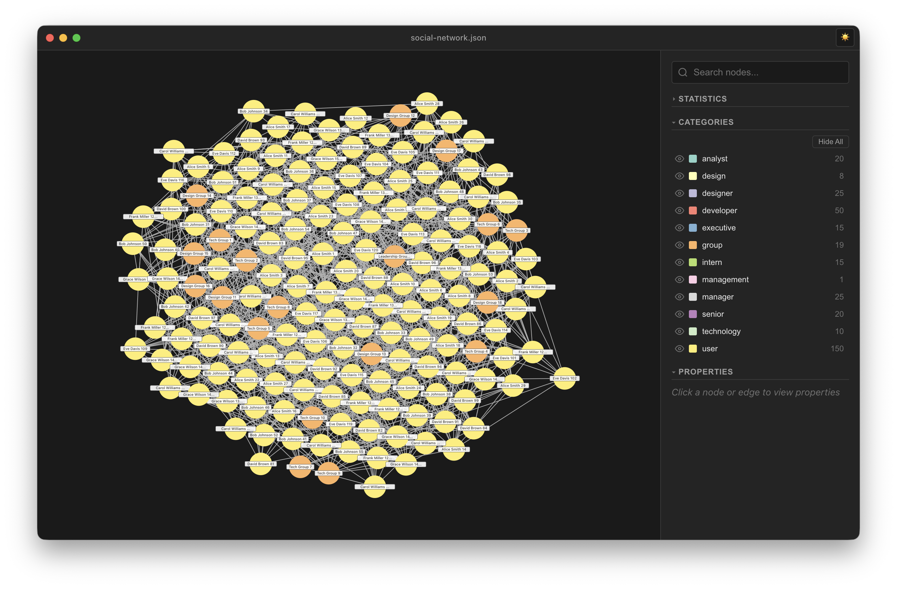

# User Interface Guide

This guide explains all components of the Generic Graph View interface.

## Overview



The application consists of three main areas:

1. **Title Bar** - File name, window controls, and theme toggle
2. **Graph Canvas** - The main visualization area
3. **Sidebar** - Search, statistics, categories, and properties panels

---

## Title Bar

The title bar (visible at the top of the screenshot above) shows:
- **Current file name** - The name of the loaded JSON file (e.g., "knowledge-graph.json")
- **Theme toggle** - Click the sun/moon icon to switch between light and dark modes

The title bar uses the native macOS "hidden inset" style, integrating with the system traffic lights.

---

## Graph Canvas

The central area where the graph visualization is displayed.

### Visual Elements

#### Nodes

Nodes are displayed as colored circles with labels:
- **Circle** - Colored based on category or custom color
- **Label** - Node name (truncated to 15 characters if needed)
- **Label background** - Semi-transparent background for readability

**Node States:**
| State | Appearance |
|-------|------------|
| Normal | Colored circle, no border |
| Hover | Yellow/highlight border |
| Selected | Thick yellow border, slightly darkened |
| Hidden | Invisible (opacity 0) |

#### Edges

Edges connect nodes:
- **Normal** - Thin gray line
- **Hover** - Thicker, highlighted
- **Selected** - Thick yellow line
- **Connected to selection** - Highlighted when either endpoint is selected
- **Hidden** - Invisible if either endpoint is hidden

### Selection Example



The image above shows:
- A selected node ("vitest") with yellow highlight
- Connected edges highlighted in yellow
- Properties panel showing node details and connected nodes

### Interactions

#### Panning
- Click and drag on the background to pan the view
- The cursor changes to a "grab" hand

#### Zooming
- **Mouse wheel** - Scroll to zoom in/out
- **Trackpad** - Pinch to zoom
- **Keyboard** - Cmd+0 to fit all, Cmd+1 to fit selection

#### Selection
- **Click node** - Select single node
- **Cmd/Ctrl+Click** - Toggle node in multi-selection
- **Click edge** - Select edge
- **Click background** - Clear selection

### Empty State

When no graph is loaded, the canvas shows:

```
No graph loaded
Use File > Open or Cmd+O to load a graph
```

### Loading State

During file loading or simulation initialization, a spinner is displayed in the top-left corner.

---

## Sidebar

The sidebar contains collapsible sections for different functionality.

### Search

The search input at the top allows finding nodes by:
- **Node ID** - Exact or partial match
- **Node name** - Exact or partial match
- **Category** - Matches nodes in that category

**Features:**
- Debounced search (150ms delay)
- Shows match count
- Automatically selects matching nodes
- Clear button (×) to reset search

**Example searches:**
- `api` - Finds nodes with "api" in ID or name
- `service` - Finds nodes with "service" in any field
- `user-123` - Finds specific node by ID

### Statistics Section

Displays graph metrics (visible in the sidebar of the screenshots):
- **File** - Current file name
- **Nodes** - Total number of nodes (e.g., 123)
- **Edges** - Total number of edges (e.g., 149)
- **Invalid Edges** - Edges referencing non-existent nodes (0 if all valid)

Click the section header to collapse/expand.

### Categories Section



Lists all categories found in the graph:

**For each category:**
- **Visibility toggle** (eye icon) - Show/hide nodes in this category
- **Color swatch** - The category's assigned color
- **Name** - Category name
- **Count** - Number of nodes with this category

**Interactions:**
- **Click** category - Select all nodes in category
- **Shift+Click** - Add category nodes to selection
- **Cmd/Ctrl+Click** - Remove category nodes from selection
- **Click eye icon** - Toggle visibility

**Hide All / Show All button** - Toggle visibility of all categories at once

The image above shows several categories hidden (eye-off icon): designer, intern, manager, senior. Notice how the graph appears less dense with fewer nodes visible.

**Note:** Nodes with multiple categories are hidden if ANY of their categories is hidden.

### Properties Section

Shows details about the current selection.

**No selection:**
```
Click a node or edge to view properties
```

**Single node selected** (see selection.png):
- Node type badge
- Node ID
- Node name
- Properties button (if node has properties)
- Categories list
- Connected nodes (clickable list)

**Multiple nodes selected:**
- Count of selected nodes
- Clickable list of all selected nodes
- Each item shows name, first category, and properties button

**Edge selected:**
- Edge type badge
- Full JSON representation of the edge

#### Connected Nodes List

When a single node is selected, the connected nodes section shows all nodes that share an edge with the selected node.

Each item in the list:
- Click to navigate to that node
- Shows node name and first category
- Properties button to view that node's properties

#### Properties Modal

Click the document icon button to open the properties modal:

- **Header** - Node name with copy button
- **Subtitle** - Node ID with copy button
- **Content** - JSON representation of all properties
- **Copy buttons** - Quick copy name, ID, or all properties

---

## Theme Support

The application supports both light and dark themes.

### Dark Theme (Default)

All provided screenshots show the dark theme:
- Dark background (#1a1a2e)
- Light text
- Yellow selection highlights
- Subtle borders and separators

### Light Theme

- Light background
- Dark text
- Black selection highlights

Toggle the theme using the sun/moon icon in the title bar.

---

## Large Graph Example



The application handles large graphs with many nodes and edges:
- Force-directed layout automatically organizes nodes
- Category colors help distinguish node types
- Pan and zoom to explore different areas

---

## Responsive Behavior

- **Sidebar** - Fixed width (280px)
- **Graph Canvas** - Fills remaining space
- **Minimum window size** - 800×600 pixels

The graph canvas automatically adjusts when the window is resized, and the simulation will re-stabilize if needed.
